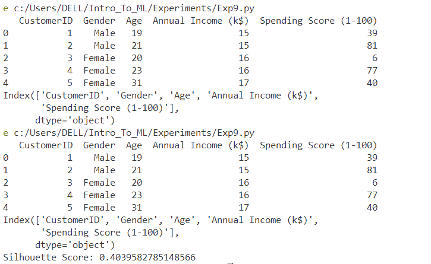
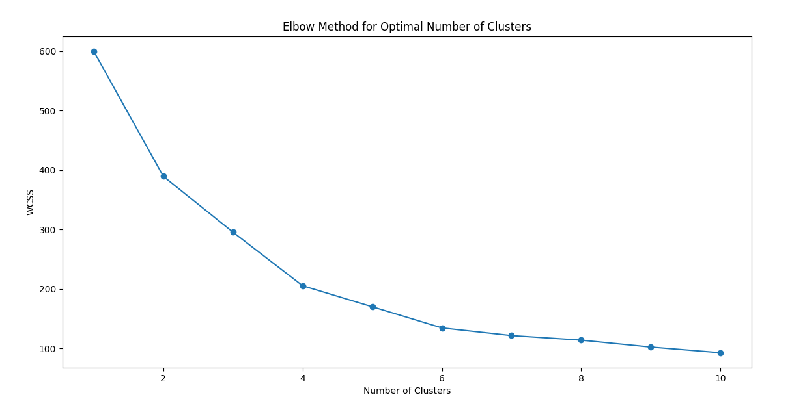
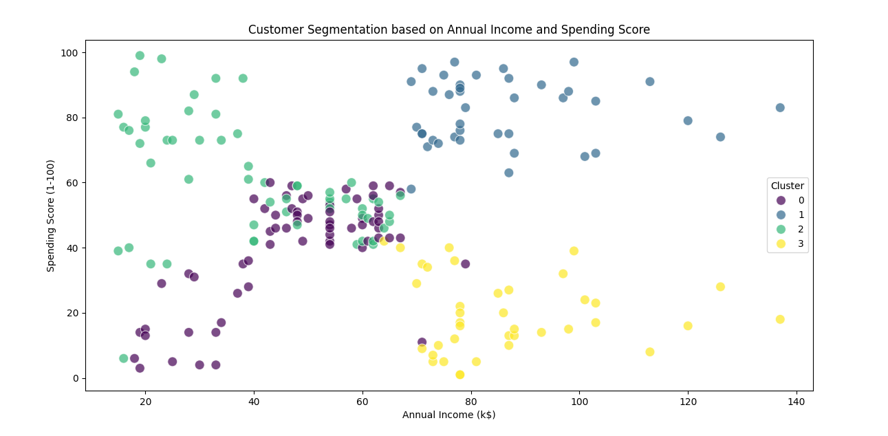

# Implementation of Customer Segmentation Using K-Means Clustering

## AIM:
To implement customer segmentation using K-Means clustering on the Mall Customers dataset to group customers based on purchasing habits.

## Equipments Required:
1. Hardware – PCs
2. Anaconda – Python 3.7 Installation / Jupyter notebook

## Algorithm
#### 1. Import Libraries

* Use pandas, seaborn, matplotlib, and scikit-learn for data manipulation, clustering, and visualization.
#### 2. Load Dataset

* Load the customer dataset from the given URL and inspect its structure.
#### 3. Feature Selection

* Select relevant features such as Age, Annual Income (k$), and Spending Score (1-100) for clustering.
#### 4. Data Preprocessing

* Standardize the selected features using StandardScaler to ensure better clustering performance.
#### 5. Optimal Cluster Determination

* Apply the Elbow Method to identify the optimal number of clusters by plotting WCSS (Within-Cluster Sum of Squares).
#### 6. K-Means Model Training

* Train a K-Means model with the optimal number of clusters (e.g., 4 based on the elbow curve).
#### 7. Cluster Evaluation

* Calculate the Silhouette Score to measure the quality of clustering.
#### 8. Cluster Visualization

* Visualize the clusters using scatter plots, coloring the points based on cluster labels, and analyzing customer segments.


## Program:
```
/*
Program to implement customer segmentation using K-Means clustering on the Mall Customers dataset.
Developed by: ASHWINA K N
RegisterNumber:  212223230025
*/
# Import necessary libraries
import pandas as pd
import matplotlib.pyplot as plt
import seaborn as sns
from sklearn.cluster import KMeans
from sklearn.preprocessing import StandardScaler
from sklearn.metrics import silhouette_score

# Step 1: Data Loading
url = "https://cf-courses-data.s3.us.cloud-object-storage.appdomain.cloud/IBM-ML0187EN-SkillsNetwork/labs/module%203/data/CustomerData.csv"
data = pd.read_csv(url)

# Step 2: Data Exploration
# Display the first few rows and column names for verification
print(data.head())
print(data.columns)

# Step 3: Feature Selection
# Select relevant features based on the dataset
# Here we will use 'Age', 'Annual Income (k$)', and 'Spending Score (1-100)' for clustering
features = ['Age', 'Annual Income (k$)', 'Spending Score (1-100)']
X = data[features]

# Step 4: Data Preprocessing
# Standardize the features to improve K-Means performance
scaler = StandardScaler()
X_scaled = scaler.fit_transform(X)

# Step 5: Determining Optimal Number of Clusters using the Elbow Method
wcss = []  # Within-cluster sum of squares
for i in range(1, 11):
    kmeans = KMeans(n_clusters=i, random_state=42)
    kmeans.fit(X_scaled)
    wcss.append(kmeans.inertia_)

# Plot the elbow curve
plt.figure(figsize=(8, 4))
plt.plot(range(1, 11), wcss, marker='o', linestyle='-')
plt.xlabel('Number of Clusters')
plt.ylabel('WCSS')
plt.title('Elbow Method for Optimal Number of Clusters')
plt.show()

# Step 6: Model Training with K-Means Clustering
# Based on the elbow curve, select an appropriate number of clusters, say 4 (adjust as needed based on the plot)
optimal_clusters = 4
kmeans = KMeans(n_clusters=optimal_clusters, random_state=42)
kmeans.fit(X_scaled)

# Step 7: Cluster Analysis and Visualization
# Add the cluster labels to the original dataset
data['Cluster'] = kmeans.labels_

# Calculate and print silhouette score for quality of clustering
sil_score = silhouette_score(X_scaled, kmeans.labels_)
print(f'Silhouette Score: {sil_score}')

# Visualize clusters based on 'Annual Income (k$)' and 'Spending Score (1-100)'
plt.figure(figsize=(10, 6))
sns.scatterplot(data=data, x='Annual Income (k$)', y='Spending Score (1-100)', hue='Cluster', palette='viridis', s=100, alpha=0.7)
plt.title('Customer Segmentation based on Annual Income and Spending Score')
plt.xlabel('Annual Income (k$)')
plt.ylabel('Spending Score (1-100)')
plt.legend(title='Cluster')
plt.show()

```

## Output:



## Result:
Thus, customer segmentation was successfully implemented using K-Means clustering, grouping customers into distinct segments based on their annual income and spending score. 
